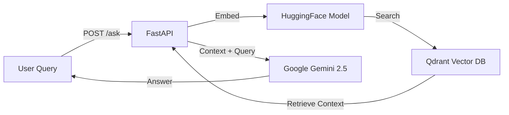
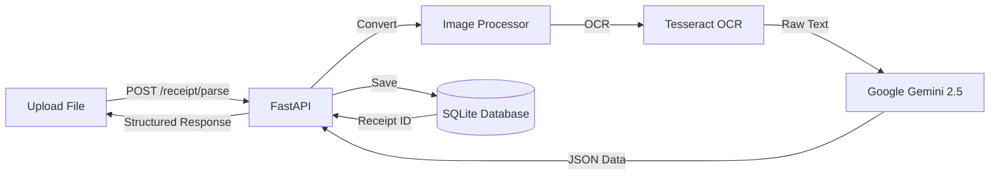

# 🤖 Enterprise RAG & Intelligent Receipt Parser

<div align="center">

[](https://www.python.org/downloads/)
[](https://fastapi.tiangolo.com)
[](https://python.langchain.com/)
[](https://www.docker.com/)
[](LICENSE)

<a href="https://huggingface.co/spaces/new?sdk=docker&template=colddsam/ERP-module-NZ">
  
</a>

</div>

---

A high-performance **Retrieval-Augmented Generation (RAG)** system and **Intelligent Receipt Parser** built with FastAPI. It leverages **Qdrant** for vector search and **Google Gemini 2.5 Flash** for generative AI and data extraction.

## ✨ Key Features

| Feature | Description |
| :--- | :--- |
| **🔍 RAG Knowledge Base** | Ingest PDF/Text documents and query them using semantic search (Qdrant) + LLM (Gemini). Support for *Contextual Answers* and *Source Attribution*. |
| **🧾 Intelligent Receipt Parser** | Extract structured data (Merchant, Date, Items, Tax) from receipt images (JPG/PNG) and PDFs using **OCR** (Tesseract/Poppler) + **AI**. |
| **⚡ High Performance** | Asynchronous API (non-blocking I/O) and global embedding model caching for low latency. |
| **🐳 Docker Ready** | Fully containerized for easy deployment to **Hugging Face Spaces** or any cloud provider. |

---

## 🧠 Architecture

### 1. RAG Query Flow


### 2. Receipt Parsing Flow


---

## 🛠 Tech Stack

| Component | Technology | Description |
| :--- | :--- | :--- |
| **Framework** | FastAPI | High-performance async Python web framework. |
| **Language** | Python 3.11+ | Modern Python features. |
| **LLM** | Google Gemini 2.5 Flash | Cost-effective, high-speed generative model. |
| **Vector DB** | Qdrant | Scalable vector search engine. |
| **OCR** | Tesseract 5, Poppler | Robust optical character recognition. |
| **Database** | SQLite / PostgreSQL | Relational storage for parsed receipts. |

---

## 🚀 Quick Start (Local)

### Prerequisites
- **Python 3.11+**
- **Tesseract OCR** ([Windows](https://github.com/UB-Mannheim/tesseract/wiki) | Linux `sudo apt install tesseract-ocr`)
- **Poppler** ([Windows](https://github.com/oschwartz10612/poppler-windows/releases/) | Linux `sudo apt install poppler-utils`)

### Installation

1.  **Clone & Setup**
    ```bash
    git clone https://github.com/colddsam/ERP-module-NZ.git
    cd ERP-module-NZ
    python -m venv .venv
    source .venv/bin/activate  # Windows: .\.venv\Scripts\activate
    pip install -r requirements.txt
    ```

2.  **Configure Environment**
    Create a `.env` file:
    ```env
    GOOGLE_API_KEY=your_key
    QDRANT_URL=your_qdrant_url
    QDRANT_API_KEY=your_qdrant_key
    EMBEDDING_MODEL=sentence-transformers/all-MiniLM-L6-v2
    LLM_MODEL=gemini-2.5-flash
    COLLECTION_NAME=rag_collection
    # Windows Paths (Update these!)
    TESSERACT_PATH=C:\Program Files\Tesseract-OCR\tesseract.exe
    POPPLER_PATH=C:\path\to\poppler\bin
    ```

3.  **Run Application**
    ```bash
    uvicorn app:app --reload
    ```
    Open **[http://127.0.0.1:8000/docs](http://127.0.0.1:8000/docs)** to test the API.

---

## 🤗 Deploy to Hugging Face Spaces

This repository is optimized for **Hugging Face Spaces (Docker SDK)**.

### 1-Click Deployment
1.  **Create a New Space**: Select **Docker** as the SDK.
2.  **Files**: Upload this entire repository.
3.  **Secrets**: Go to **Settings** > **Variables and secrets** and add:
    - `GOOGLE_API_KEY`
    - `QDRANT_URL`
    - `QDRANT_API_KEY`
    - `QDRANT_API_KEY`
4.  **Done!** The Space will build and launch automatically.

*Note: The `Dockerfile` handles all system dependencies (Tesseract, Poppler, GLib) required for OCR.*

---

## 🔌 API Reference

| Method | Endpoint | Use Case | Body |
| :--- | :--- | :--- | :--- |
| `GET` | `/` | Health Check | - |
| `POST` | `/ingest/company` | Upload Documents to RAG | Multipart (Files) |
| `POST` | `/ask` | Query Knowledge Base | JSON `{"query": "..."}` |
| `POST` | `/receipt/parse` | Extract Data from Receipt | Multipart (Image/PDF) |

### Example: Parse a Receipt
```bash
curl -X 'POST' \
  'http://localhost:8000/receipt/parse' \
  -H 'accept: application/json' \
  -H 'Content-Type: multipart/form-data' \
  -F 'files=@receipt.jpg;type=image/jpeg'
```
