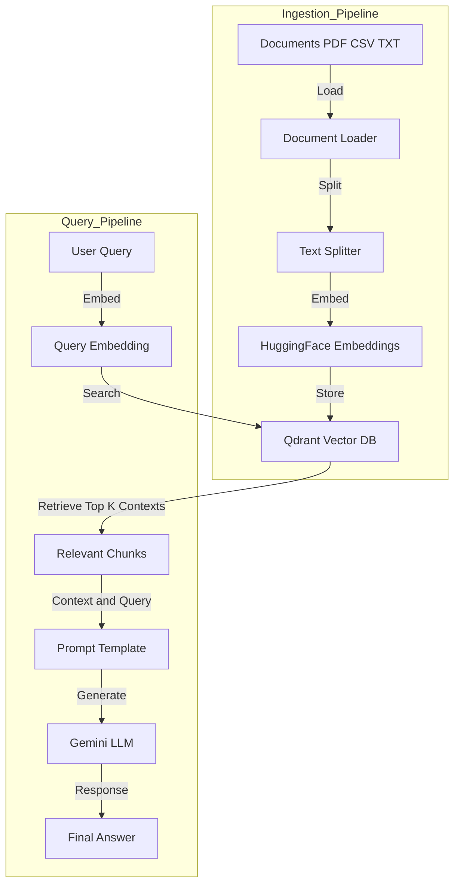

# 🤖 RAG Customer Support System (FastAPI + LangChain + Qdrant)

A powerful **Retrieval-Augmented Generation (RAG)** system designed for automated customer support. It ingests documents, stores them as vector embeddings, and uses a Large Language Model (LLM) to answer user queries with high accuracy and source attribution.


## ✨ Features

- **Document Ingestion**: Supports PDF, CSV, and TXT files with automatic metadata extraction.
- **Smart Chunking**: Uses `RecursiveCharacterTextSplitter` for optimal context preservation.
- **Vector Search**: Fast and scalable retrieval using **Qdrant**.
- **Generative AI**: Integrated with **Google Gemini (LLM)** for natural language responses.
- **Strict Context**: Answers are grounded strictly in the provided documents to prevent hallucinations.
- **FastAPI Backend**: Robust and efficient API for integration.

---

## 🧠 Architecture Flow



---

## 🛠 Tech Stack

* **Framework**: [FastAPI](https://fastapi.tiangolo.com/)
* **LLM Orchestration**: [LangChain](https://www.langchain.com/)
* **Vector Database**: [Qdrant](https://qdrant.tech/)
* **LLM**: [Google Gemini](https://ai.google.dev/)
* **Embeddings**: [HuggingFace](https://huggingface.co/) (`sentence-transformers/all-MiniLM-L6-v2`)

---

## 📦 Prerequisites

Before running the project, ensure you have:

1. **Python 3.9+** installed.
2. **Qdrant Instance**:
* [Qdrant Cloud](https://cloud.qdrant.io/) (Free Tier available) OR
* Local Qdrant Docker instance.


3. **Google AI Studio API Key**: Get it [here](https://aistudio.google.com/).

---

## 🚀 Installation & Setup

### 1. Clone the Repository

```bash
git clone [https://github.com/colddsam/ERP-module-NZ.git](https://github.com/colddsam/ERP-module-NZ.git)
cd ERP-module-NZ

```

### 2. Create a Virtual Environment

**Windows:**

```powershell
python -m venv venv
.\venv\Scripts\activate

```

**macOS / Linux:**

```bash
python3 -m venv venv
source venv/bin/activate

```

### 3. Install Dependencies

```bash
pip install -r requirements.txt

```

### 4. Configure Environment Variables

Create a `.env` file in the root directory and add your credentials:

```env
# Models
EMBEDDING_MODEL=sentence-transformers/all-MiniLM-L6-v2
LLM_MODEL=gemini-2.0-flash-exp

# API Keys & Endpoints
GOOGLE_API_KEY=your_google_api_key_here
QDRANT_ENDPOINT=your_qdrant_url (e.g., [https://xyz.qdrant.tech](https://xyz.qdrant.tech))
QDRANT_API_KEY=your_qdrant_api_key
COLLECTION_NAME=rag

```

---

## 📖 Usage Guide

### Phase 1: Ingesting Data 📂

Place your documents inside the `datasource/` directory. You can organize them into subfolders (e.g., `hr/`, `finance/`) which will be captured as metadata.

**Supported formats:** `.pdf`, `.csv`, `.txt`

Run the ingestion script:

```bash
python main.py

```

*This script will load documents, chunk them, generate embeddings, and upload them to your Qdrant collection.*

### Phase 2: Starting the API Server ⚡

Launch the FastAPI server using Uvicorn:

```bash
uvicorn app:app --reload

```

The server will start at `http://127.0.0.1:8000`.

---

## 🔌 API Endpoints

You can interact with the API via the [Swagger UI](http://127.0.0.1:8000/docs).

### 1. Health Check

* **GET** `/health`
* Checks if the server is running.
* **Response**: `{"status": "ok"}`

### 2. Ask a Question

* **POST** `/ask`
* **Body**:
```json
{
  "query": "What is the policy on remote work?"
}

```


* **Response**:
```json
{
  "answer": "Remote work is allowed up to 2 days a week... (Source: hr/policies.pdf)"
}

```


### 3. Trigger Ingestion (via API)

* **POST** `/ingest`
* Triggers the ingestion process for files currently in `datasource/`.

---

## 📂 Project Structure

```plaintext
ERP-module-NZ/
├── app.py                 # FastAPI application entry point
├── main.py                # Standalone script for data ingestion
├── requirements.txt       # Project dependencies
├── .env                   # Environment variables (not committed)
├── README.md              # Project documentation
├── datasource/            # Directory for input documents
│   └── ...
├── schemas/
│   └── schemas.py         # Pydantic models for API requests/responses
└── utils/
    ├── ingest.py          # Logic for loading, splitting, and embedding docs
    └── rag.py             # RAG engine (Retrieval + Generation logic)

```

---

## 📜 License

Licensed under Apache 2.0.
